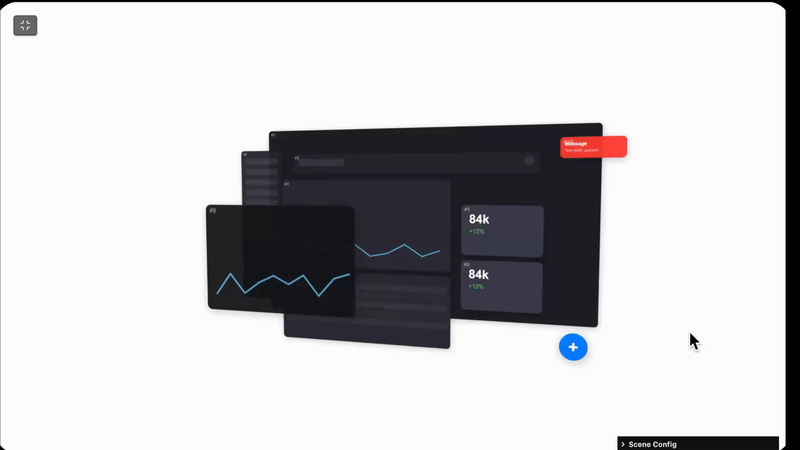
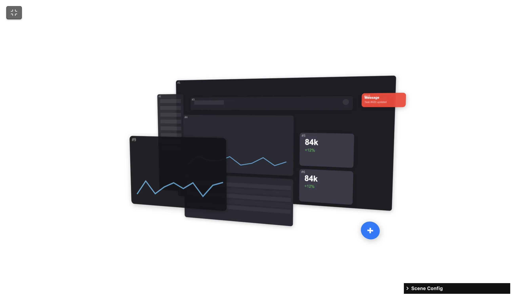

  
  
  <h1 align="center">SCENE UI</h1>
  <h3 align="center"> Interactive Three.js 3D UI Scene Builder </h3>

  <!-- TOP PURPLE LINKS -->
  
  
  
   
  <!-- BOTTOM GOLD TAXONOMY -->
  
  
  
  

  

    <i> An interactive Three.js 3D scene builder rendering layered UI panels in a parallax WebGL stage with GSAP animations and real-time Lil-GUI controls. </i>
  

  

Welcome to **Scene UI**, a high-performance WebGL-based 3D scene composition tool designed for Obsidian using Datacore. It renders layered UI panel mockups as Three.js planes in a parallax stage, driven by real-time GSAP animations and a fully configurable Lil-GUI controls panel — all cached locally so it works offline after first load.

---

## Quick Start

To start trying Scene UI today:
1. **Download the Repository**: Clone or download this repository directly into any folder inside your Obsidian vault.
2. **Install Datacore**: Ensure you have the **Datacore** plugin installed and enabled in Obsidian.
3. **Open the Entry Note**: Open the **`SCENE UI.md`** note inside Obsidian to launch the component!

---

## Features

### 3D Parallax Stage
*   **Ten Configurable Layers**: Background, sidebar, header, charts, cards, table, notification, and floating button panels rendered as Three.js `PlaneGeometry` meshes.
*   **Mouse-Driven Parallax**: Smooth rotation tracking following the cursor for a depth-of-field illusion.
*   **GSAP Fly-in Animation**: Every layer launches from a randomized origin position and rotates into place with elastic easing.

### Real-Time Scene Controls
*   **Lil-GUI Control Panel**: Live adjust background color, global scale, animation duration, tilt angles, and border radius.
*   **Per-Layer Controls**: Move, scale, and opacity-adjust each individual layer independently.
*   **Image Upload**: Replace any layer's color panel with a real image via drag-and-drop file upload.

### Fully Adaptive Theme Support
*   **Host-Native Theme Adaptability**: Control panel, borders, and text automatically match Obsidian's active theme using native CSS variables.
*   **Immersive Full-Tab Mode**: Hides the Obsidian status bar and view footers for an edge-to-edge canvas experience.

### Offline-First Script Loading
*   **Local CDN Caching**: Three.js, GSAP, and Lil-GUI are fetched once and cached under `data/cache/scripts/` for offline use.
*   **HMR Reload Daemon**: A polling agent watches `data/mcp_commands.json` for hot-reload triggers from external tools.

---

## Directory Index & Components

The package exposes the following compiled files:

| File | Description |
| :--- | :--- |
| **[SCENE UI.md](SCENE%20UI.md)** | The main entry point leaf designed to be loaded inside Obsidian panes. |
| **[src/index.jsx](src/index.jsx)** | Main bootstrap application loader and polling invalidation daemon. |
| **[src/App.jsx](src/App.jsx)** | The view coordinator loading dependency modules and handling DOM reparenting. |
| **[src/components/SceneComponent.jsx](src/components/SceneComponent.jsx)** | The core WebGL 3D scene component using Three.js, GSAP, and Lil-GUI. |
| **[src/styles/styles.jsx](src/styles/styles.jsx)** | Helper styling sheet mapped to Obsidian native CSS variables. |
| **[src/utils/domUtils.jsx](src/utils/domUtils.jsx)** | DOM helper utilities for ancestor and child class traversal. |
| **[src/utils/LoadScriptUpgrade.js](src/utils/LoadScriptUpgrade.js)** | Self-contained ESM/UMD script loader with local vault cache support. |
| **[data/mcp_commands.json](data/mcp_commands.json)** | Local polling payload for HMR invalidation. |
| **[METADATA.md](METADATA.md)** | Packaging manifest outlining indexing, target, and security configurations. |
| **[CONTRIBUTION.md](CONTRIBUTION.md)** | Contributor architecture standards and local development guidelines. |
| **[LICENSE.md](LICENSE.md)** | MIT open-source license. |

---

## Previews

| Static Mockup | Interactive 3D Stage |
| :---: | :---: |
|  |  |

---

## Attribution

The visual and mathematical core of the procedural light flow and line segments geometry in this project was ported and adapted from a creative experiment originally published on [CodePen](https://codepen.io/).

---

## Contributors
- beto.group
